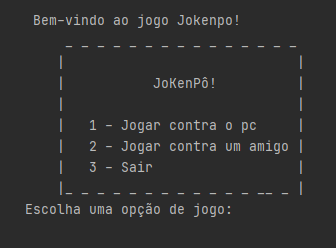
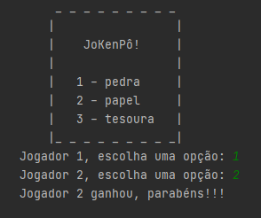

<h1 align="center"> Rock Paper Scissors </h1>

 Game Programming

## 🎯 Functionalities
✔️ The program allows the user to play Jokenpô, either against the machine or another player;  
✔️ The code allows the user to play as many times as he wants;  
✔️ The code performs a draw when the option to play against the machine is chosen;  
✔️ The program recognizes errors.

## 🚀 Languages
✔️ Python.

## 🎨 Layout

       &nbsp; &nbsp; 
       &nbsp; &nbsp;  
      
## ⚖️ License
✔️ MIT License.

## 🔥 About Myself
  

  
   
  

