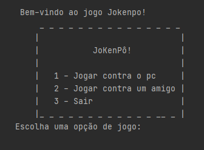
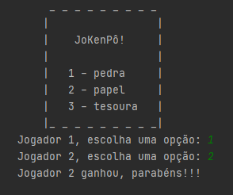

<h1 align="center"> Jokenpô </h1>

Programação do jogo

## 🎯 Funcionalidades
✔️ O programa permite ao usuário jogar Jokenpô, seja contra a máquina ou outro jogador;  
✔️ O programa permite ao usuário jogar quantas vezes desejar;  
✔️ O programa realiza um sorteio quando a opção de jogar contra a máquina é escolhida;  
✔️ O programa reconhece os erros.

## 🚀 Linguagens
✔️ Foi utilizado Python em todo o projeto.

## 🎨 Layout

       &nbsp; &nbsp; 
       &nbsp; &nbsp;  
       &nbsp; &nbsp; 
      
## ⚖️ Licença
✔️ MIT License.

## 🔥 Sobre mim 
  

  

  
   
  

